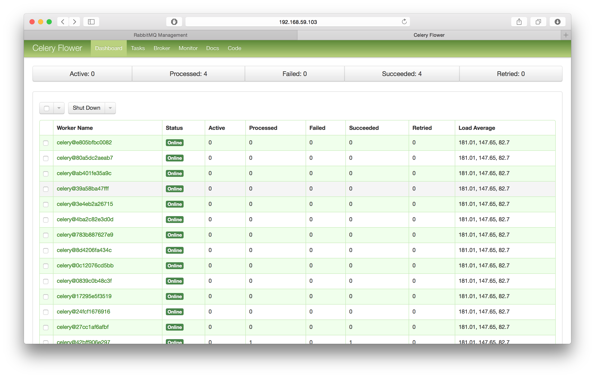
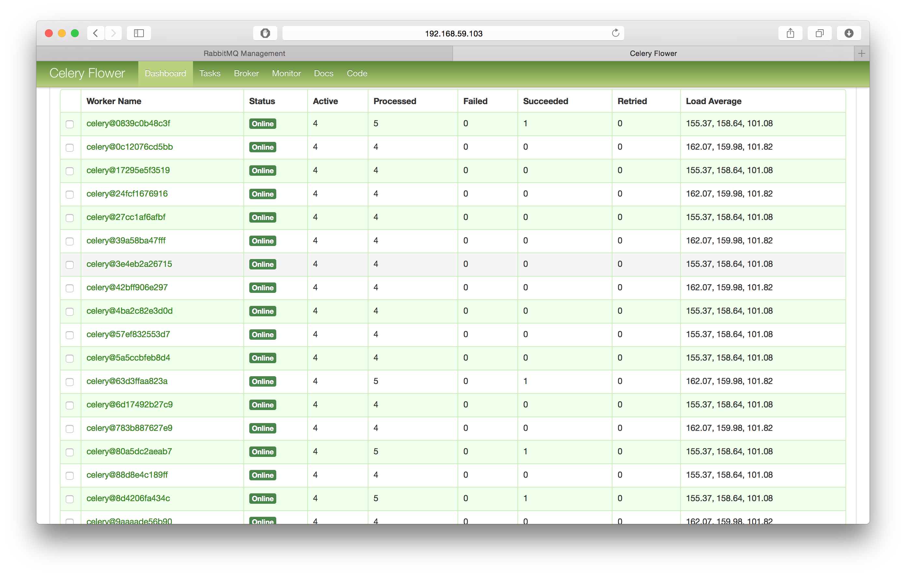
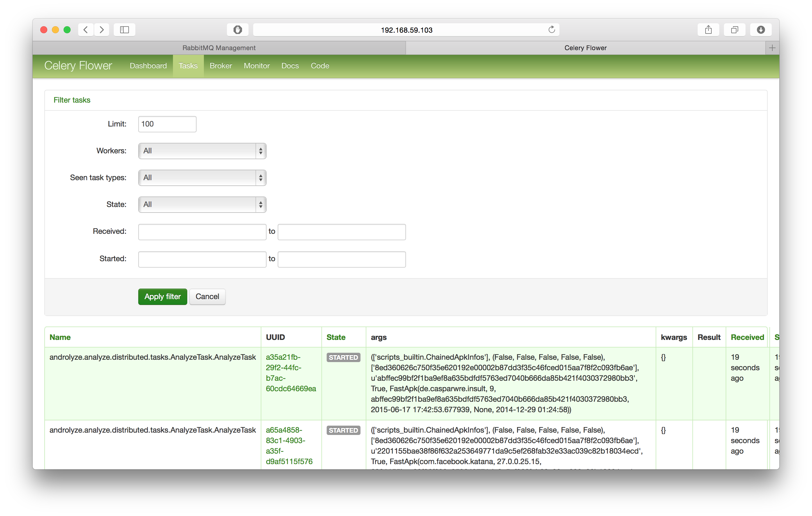
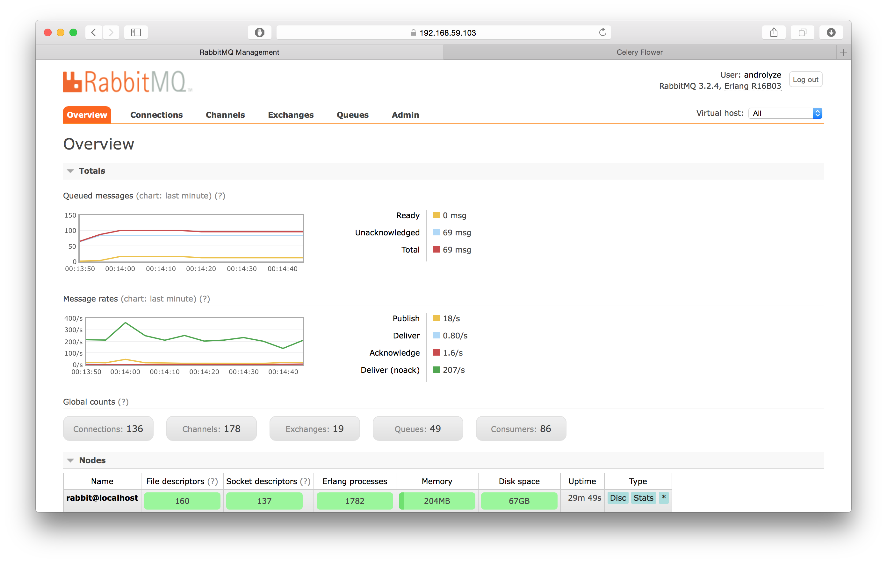
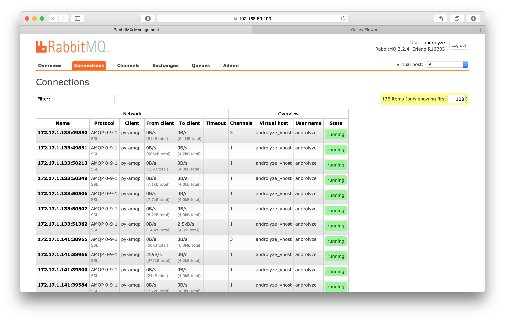

Monitoring / Management
=======================

`AndroLyze` has a few ways to monitor the current analysis.
First of all you can use a simple bash script to the check status of each worker which is currently registered at the message queue:

.. code-block:: sh

	worker@fba930455a9c:/home/worker/androlyze$ sh management/check_status.sh
   INFO: appending "androguard/" to sys.path
   -> celery@6d94b9fdaccc: OK
       - empty -
   -> celery@fba930455a9c: OK
       - empty -
   -> celery@27575180f00d: OK
       - empty -
   -> celery@16ce2eddb337: OK
       - empty -

The monitoring includes also the tasks the workers are executing at the moment.

.. code-block:: sh

   -> celery@6d94b9fdaccc: OK
       * {u'args': u"(['scripts_builtin.ChainedApkInfos'], (False, False, False, False, False), ['8ed360626c750f35e620192e00002b87dd3f35c46fced015aa7f8f2c093fb6ae'], u'd1c01f118eb0e0d3edfed46db1e1cd609e95ad9e19d2e4042e42f633f6e05ae7', True, FastApk(com.freeletics.lite, 2.5, d1c01f118eb0e0d3edfed46db1e1cd609e95ad9e19d2e4042e42f633f6e05ae7, 2015-06-17 17:43:07.129660, None, 2015-03-02 09:35:20))", u'time_start': 93154.336766429, u'name': u'androlyze.analyze.distributed.tasks.AnalyzeTask.AnalyzeTask', u'delivery_info': {u'priority': None, u'redelivered': False, u'routing_key': u'analyze_apk', u'exchange': u'celery'}, u'hostname': u'celery@6d94b9fdaccc', u'acknowledged': False, u'kwargs': u'{}', u'id': u'14c1b604-2bf0-47f9-be98-61cef5931345', u'worker_pid': 97}
       * {u'args': u"(['scripts_builtin.ChainedApkInfos'], (False, False, False, False, False), ['8ed360626c750f35e620192e00002b87dd3f35c46fced015aa7f8f2c093fb6ae'], u'43bf774b2795459bbcdfa0a5c40843dc2485000a20dad3dda4c41b08df057fc9', True, FastApk(com.microsoft.office.outlook, 1.0.5, 43bf774b2795459bbcdfa0a5c40843dc2485000a20dad3dda4c41b08df057fc9, 2015-06-17 17:43:15.148223, None, 2015-02-17 10:37:32))", u'time_start': 93154.294892248, u'name': u'androlyze.analyze.distributed.tasks.AnalyzeTask.AnalyzeTask', u'delivery_info': {u'priority': None, u'redelivered': False, u'routing_key': u'analyze_apk', u'exchange': u'celery'}, u'hostname': u'celery@6d94b9fdaccc', u'acknowledged': False, u'kwargs': u'{}', u'id': u'7eb50c9b-533a-4078-b60d-e575173eed1f', u'worker_pid': 94}
       * {u'args': u"(['scripts_builtin.ChainedApkInfos'], (False, False, False, False, False), ['8ed360626c750f35e620192e00002b87dd3f35c46fced015aa7f8f2c093fb6ae'], u'9e6bf1cb31f5cff3a3d8e39a16ca8c34590ad68ae840b4bb7995f185af0f0994', True, FastApk(com.ebay.mobile, 2.8.2.1, 9e6bf1cb31f5cff3a3d8e39a16ca8c34590ad68ae840b4bb7995f185af0f0994, 2015-06-17 17:43:16.024391, None, 2014-11-12 09:57:38))", u'time_start': 93154.267301966, u'name': u'androlyze.analyze.distributed.tasks.AnalyzeTask.AnalyzeTask', u'delivery_info': {u'priority': None, u'redelivered': False, u'routing_key': u'analyze_apk', u'exchange': u'celery'}, u'hostname': u'celery@6d94b9fdaccc', u'acknowledged': False, u'kwargs': u'{}', u'id': u'198742d5-f8c0-490f-ad98-068a6938b1de', u'worker_pid': 96}
       * {u'args': u"(['scripts_builtin.ChainedApkInfos'], (False, False, False, False, False), ['8ed360626c750f35e620192e00002b87dd3f35c46fced015aa7f8f2c093fb6ae'], u'a9fc9e0d5d2da6f24b945b31b6053ff6a96b9cbbc1eb5600b69c4c5651fd8efd', True, FastApk(com.snapchat.android, 9.2.0.0, a9fc9e0d5d2da6f24b945b31b6053ff6a96b9cbbc1eb5600b69c4c5651fd8efd, 2015-06-17 17:43:14.931758, None, 2015-02-24 08:13:54))", u'time_start': 93154.378777605, u'name': u'androlyze.analyze.distributed.tasks.AnalyzeTask.AnalyzeTask', u'delivery_info': {u'priority': None, u'redelivered': False, u'routing_key': u'analyze_apk', u'exchange': u'celery'}, u'hostname': u'celery@6d94b9fdaccc', u'acknowledged': False, u'kwargs': u'{}', u'id': u'2c77637a-4b06-42d4-b6ee-e39b451b0312', u'worker_pid': 95}
   -> celery@fba930455a9c: OK
       * {u'args': u"(['scripts_builtin.ChainedApkInfos'], (False, False, False, False, False), ['8ed360626c750f35e620192e00002b87dd3f35c46fced015aa7f8f2c093fb6ae'], u'2d7a934f2fb8a60b9c690bfbd8884f47611ed3cb073805a3bcc35825806886fb', True, FastApk(com.shazam.android, 5.3.1-15022714, 2d7a934f2fb8a60b9c690bfbd8884f47611ed3cb073805a3bcc35825806886fb, 2015-06-17 17:43:06.956667, None, 2015-02-27 14:35:44))", u'time_start': 93154.309475294, u'name': u'androlyze.analyze.distributed.tasks.AnalyzeTask.AnalyzeTask', u'delivery_info': {u'priority': None, u'redelivered': False, u'routing_key': u'analyze_apk', u'exchange': u'celery'}, u'hostname': u'celery@fba930455a9c', u'acknowledged': False, u'kwargs': u'{}', u'id': u'6b35e1a9-7068-4729-979a-8eecea9c6183', u'worker_pid': 101}
       * {u'args': u"(['scripts_builtin.ChainedApkInfos'], (False, False, False, False, False), ['8ed360626c750f35e620192e00002b87dd3f35c46fced015aa7f8f2c093fb6ae'], u'6b4d5f2b0db9e955ddc0cc5ddf58d3ada5f0097f4d65a372125ccdbd0f420cf2', True, FastApk(com.runtastic.android, 5.7.1, 6b4d5f2b0db9e955ddc0cc5ddf58d3ada5f0097f4d65a372125ccdbd0f420cf2, 2015-06-17 17:43:03.427886, None, 2015-02-17 10:55:24))", u'time_start': 93154.285464962, u'name': u'androlyze.analyze.distributed.tasks.AnalyzeTask.AnalyzeTask', u'delivery_info': {u'priority': None, u'redelivered': False, u'routing_key': u'analyze_apk', u'exchange': u'celery'}, u'hostname': u'celery@fba930455a9c', u'acknowledged': False, u'kwargs': u'{}', u'id': u'26db058e-65de-4147-96f7-68f2a52dd292', u'worker_pid': 102}
       * {u'args': u"(['scripts_builtin.ChainedApkInfos'], (False, False, False, False, False), ['8ed360626c750f35e620192e00002b87dd3f35c46fced015aa7f8f2c093fb6ae'], u'd28c4d3f2e757beef6234601c6f5bfc462699a656aa53573541bb41527dd3cae', True, FastApk(com.infraware.office.link, 6.0.9, d28c4d3f2e757beef6234601c6f5bfc462699a656aa53573541bb41527dd3cae, 2015-06-17 17:42:56.857422, None, 2015-02-13 03:27:20))", u'time_start': 93154.260862799, u'name': u'androlyze.analyze.distributed.tasks.AnalyzeTask.AnalyzeTask', u'delivery_info': {u'priority': None, u'redelivered': False, u'routing_key': u'analyze_apk', u'exchange': u'celery'}, u'hostname': u'celery@fba930455a9c', u'acknowledged': False, u'kwargs': u'{}', u'id': u'8fb6cfc7-beca-478f-9375-17874cb90b3b', u'worker_pid': 100}
       * {u'args': u"(['scripts_builtin.ChainedApkInfos'], (False, False, False, False, False), ['8ed360626c750f35e620192e00002b87dd3f35c46fced015aa7f8f2c093fb6ae'], u'5db7f91524a5e8eeb6398f8f2a3189393d5ed7cce457c1d07d7a2754487c4330', True, FastApk(com.yodo1.crossyroad, 1.0.3, 5db7f91524a5e8eeb6398f8f2a3189393d5ed7cce457c1d07d7a2754487c4330, 2015-06-17 17:43:01.521850, None, 2015-02-09 18:11:06))", u'time_start': 93154.368736285, u'name': u'androlyze.analyze.distributed.tasks.AnalyzeTask.AnalyzeTask', u'delivery_info': {u'priority': None, u'redelivered': False, u'routing_key': u'analyze_apk', u'exchange': u'celery'}, u'hostname': u'celery@fba930455a9c', u'acknowledged': False, u'kwargs': u'{}', u'id': u'08ac588d-a1ea-457d-891c-f3df5d176583', u'worker_pid': 99}
   -> celery@16ce2eddb337: OK
       * {u'args': u"(['scripts_builtin.ChainedApkInfos'], (False, False, False, False, False), ['8ed360626c750f35e620192e00002b87dd3f35c46fced015aa7f8f2c093fb6ae'], u'86c6f9ca30f40f03ddff9c06dd30f7ec31420e214c4ae77a364ca5c74ecb8cbf', True, FastApk(com.amazon.mShop.android.shopping, 5.2.3, 86c6f9ca30f40f03ddff9c06dd30f7ec31420e214c4ae77a364ca5c74ecb8cbf, 2015-06-17 17:43:12.076072, None, 2014-12-10 06:31:52))", u'time_start': 93154.341224899, u'name': u'androlyze.analyze.distributed.tasks.AnalyzeTask.AnalyzeTask', u'delivery_info': {u'priority': None, u'redelivered': False, u'routing_key': u'analyze_apk', u'exchange': u'celery'}, u'hostname': u'celery@16ce2eddb337', u'acknowledged': False, u'kwargs': u'{}', u'id': u'7379d06d-9a86-4fec-87c1-b8c55ee0e65f', u'worker_pid': 98}
       * {u'args': u"(['scripts_builtin.ChainedApkInfos'], (False, False, False, False, False), ['8ed360626c750f35e620192e00002b87dd3f35c46fced015aa7f8f2c093fb6ae'], u'9152cbac4c37551d653ec4f21b6146ab7c89b0125929b5ba8b618b610b523a8e', True, FastApk(de.motain.iliga, 6.0.8, 9152cbac4c37551d653ec4f21b6146ab7c89b0125929b5ba8b618b610b523a8e, 2015-06-17 17:43:15.866802, None, 2015-02-24 08:42:10))", u'time_start': 93154.302233582, u'name': u'androlyze.analyze.distributed.tasks.AnalyzeTask.AnalyzeTask', u'delivery_info': {u'priority': None, u'redelivered': False, u'routing_key': u'analyze_apk', u'exchange': u'celery'}, u'hostname': u'celery@16ce2eddb337', u'acknowledged': False, u'kwargs': u'{}', u'id': u'56717233-16b6-478f-9101-56bd8daf8e76', u'worker_pid': 95}
       * {u'args': u"(['scripts_builtin.ChainedApkInfos'], (False, False, False, False, False), ['8ed360626c750f35e620192e00002b87dd3f35c46fced015aa7f8f2c093fb6ae'], u'32523ddf6a7c512bd5e99ca538da33b4aad4d0329bf7f6fd19e48f015da61cb4', True, FastApk(com.amazon.kindle, 4.9.0.158, 32523ddf6a7c512bd5e99ca538da33b4aad4d0329bf7f6fd19e48f015da61cb4, 2015-06-17 17:42:55.212787, None, 2015-02-04 16:38:34))", u'time_start': 93154.273260892, u'name': u'androlyze.analyze.distributed.tasks.AnalyzeTask.AnalyzeTask', u'delivery_info': {u'priority': None, u'redelivered': False, u'routing_key': u'analyze_apk', u'exchange': u'celery'}, u'hostname': u'celery@16ce2eddb337', u'acknowledged': False, u'kwargs': u'{}', u'id': u'7f0dcc7a-aaad-4c5d-a8b0-520b244d70bd', u'worker_pid': 97}
       * {u'args': u"(['scripts_builtin.ChainedApkInfos'], (False, False, False, False, False), ['8ed360626c750f35e620192e00002b87dd3f35c46fced015aa7f8f2c093fb6ae'], u'ef52e4ba18c54f82bad12e39b807df9753162caec73eaeb6f25c4d18ef679f68', True, FastApk(de.kaufda.android, 7.0.1, ef52e4ba18c54f82bad12e39b807df9753162caec73eaeb6f25c4d18ef679f68, 2015-06-17 17:42:53.989841, None, 2015-02-16 14:49:04))", u'time_start': 93154.394055117, u'name': u'androlyze.analyze.distributed.tasks.AnalyzeTask.AnalyzeTask', u'delivery_info': {u'priority': None, u'redelivered': False, u'routing_key': u'analyze_apk', u'exchange': u'celery'}, u'hostname': u'celery@16ce2eddb337', u'acknowledged': False, u'kwargs': u'{}', u'id': u'7721aff1-29fd-42ff-a12b-4eb167847bc8', u'worker_pid': 96}
   -> celery@27575180f00d: OK
       * {u'args': u"(['scripts_builtin.ChainedApkInfos'], (False, False, False, False, False), ['8ed360626c750f35e620192e00002b87dd3f35c46fced015aa7f8f2c093fb6ae'], u'0270160f6ec17cb3f3055e686fc273f8afa3f2236330bac66e12ef539e6fc5d8', True, FastApk(com.picsart.studio, 5.0.0.14, 0270160f6ec17cb3f3055e686fc273f8afa3f2236330bac66e12ef539e6fc5d8, 2015-06-17 17:42:53.466250, None, 2014-12-29 15:30:12))", u'time_start': 93154.351653813, u'name': u'androlyze.analyze.distributed.tasks.AnalyzeTask.AnalyzeTask', u'delivery_info': {u'priority': None, u'redelivered': False, u'routing_key': u'analyze_apk', u'exchange': u'celery'}, u'hostname': u'celery@27575180f00d', u'acknowledged': False, u'kwargs': u'{}', u'id': u'ec390a9f-735e-473e-ac65-873e1cc36f6e', u'worker_pid': 99}
       * {u'args': u"(['scripts_builtin.ChainedApkInfos'], (False, False, False, False, False), ['8ed360626c750f35e620192e00002b87dd3f35c46fced015aa7f8f2c093fb6ae'], u'e7d3ebfdd88d3605de3fb7d3a1717524cfad4aedad002998bf6ef1d3af8a790d', True, FastApk(de.postbank.finanzassistent, 2.0.2, e7d3ebfdd88d3605de3fb7d3a1717524cfad4aedad002998bf6ef1d3af8a790d, 2015-06-17 17:43:00.248399, None, 2014-12-16 10:53:38))", u'time_start': 93154.306459678, u'name': u'androlyze.analyze.distributed.tasks.AnalyzeTask.AnalyzeTask', u'delivery_info': {u'priority': None, u'redelivered': False, u'routing_key': u'analyze_apk', u'exchange': u'celery'}, u'hostname': u'celery@27575180f00d', u'acknowledged': False, u'kwargs': u'{}', u'id': u'70048002-ab33-48bb-9306-bcb043c0f567', u'worker_pid': 96}
       * {u'args': u"(['scripts_builtin.ChainedApkInfos'], (False, False, False, False, False), ['8ed360626c750f35e620192e00002b87dd3f35c46fced015aa7f8f2c093fb6ae'], u'4d2afc03880795a561e8eb762314d135d7a777d50daa72fafbcb64b1cbb7ae4d', True, FastApk(com.myfitnesspal.android, 3.7.3, 4d2afc03880795a561e8eb762314d135d7a777d50daa72fafbcb64b1cbb7ae4d, 2015-06-17 17:43:03.627133, None, 2015-02-09 07:47:10))", u'time_start': 93154.281455697, u'name': u'androlyze.analyze.distributed.tasks.AnalyzeTask.AnalyzeTask', u'delivery_info': {u'priority': None, u'redelivered': False, u'routing_key': u'analyze_apk', u'exchange': u'celery'}, u'hostname': u'celery@27575180f00d', u'acknowledged': False, u'kwargs': u'{}', u'id': u'ac152fe6-cc09-44fa-a41b-88de315ea3f7', u'worker_pid': 98}
       * {u'args': u"(['scripts_builtin.ChainedApkInfos'], (False, False, False, False, False), ['8ed360626c750f35e620192e00002b87dd3f35c46fced015aa7f8f2c093fb6ae'], u'bc0cd6fd5b57b75150cbc30727bec88da4e842c2590cc235ceadb7aa43b0877d', True, FastApk(com.eisterhues_media_2, 3.0.4, bc0cd6fd5b57b75150cbc30727bec88da4e842c2590cc235ceadb7aa43b0877d, 2015-06-17 17:43:14.607490, None, 2015-02-20 13:32:16))", u'time_start': 93154.407142263, u'name': u'androlyze.analyze.distributed.tasks.AnalyzeTask.AnalyzeTask', u'delivery_info': {u'priority': None, u'redelivered': False, u'routing_key': u'analyze_apk', u'exchange': u'celery'}, u'hostname': u'celery@27575180f00d', u'acknowledged': False, u'kwargs': u'{}', u'id': u'd5605555-74f6-4e7c-87b8-6bf1df6bc0f5', u'worker_pid': 97}

There are also two graphical monitoring tools included in the Docker distribution of `AndroLyze`.

* The first is `celery flower <http://flower.readthedocs.org/en/latest/>`_ which can be accessed at port 5555 on the docker host system (no https!).

* The second is the `management plugin of RabbitMQ <https://www.rabbitmq.com/management.html>`_ which can be accessed at port 15672 on the docker host system (https !).

Task Revocation
---------------

By default tasks are revoked in the distributed mode when the user aborts the analysis. This means that all tasks are marked as "revoked" and all workers killed with "SIGKILL".
If a worker consumes this flagged task it won't get executed.

If task revocation is disabled in the config, there is still a way to do the task revocation by hand (without killing the workers)

.. code-block:: sh

    worker@06f5e795c279:/home/worker/androlyze$ sh management/purge_tasks.sh
    INFO: appending "androguard/" to sys.path
    -> connecting to amqp://androlyze:**@172.17.0.2:5671/androlyze_vhost.
    -> connected.
    ok. 88 messages deleted.
    INFO: appending "androguard/" to sys.path
    -> connecting to amqp://androlyze:**@172.17.0.2:5671/androlyze_vhost.
    -> connected.
    ok. 0 messages deleted.